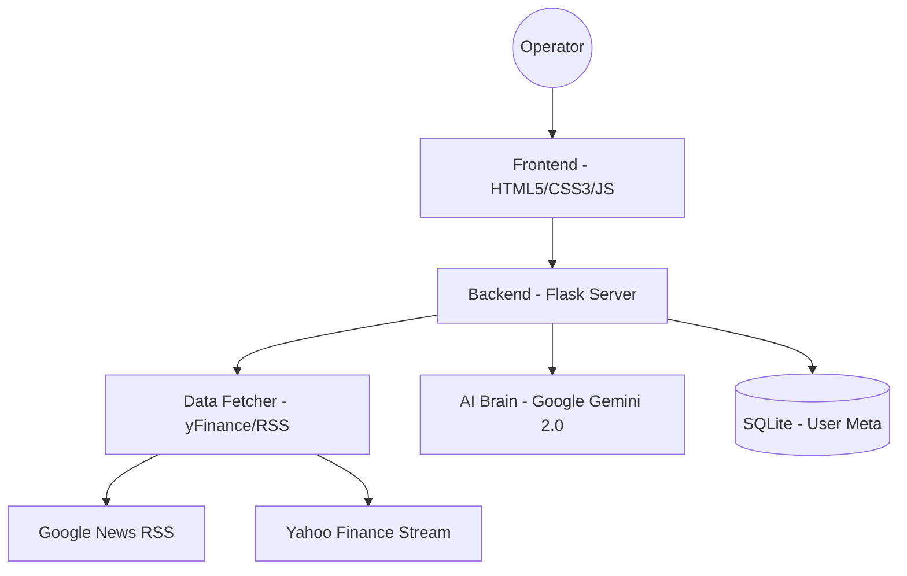

# High-Level Design (HLD) - Sood AI Terminal
**Version:** 4.2.0  
**Status:** Active  
**Last Updated:** 2026-04-20  

## 1. Executive Summary
Sood AI is a high-performance trading terminal designed for elite tactical traders. It combines real-time market data with a "Kingpin" AI analysis engine to provide definitive Entry/Exit strategies.

## 2. System Architecture
The system follows a classic Client-Server architecture with a specialized AI-Brain layer.

## 3. Core Modules
- **Authentication Hub**: Zero-Click Google OAuth & Persistent Local Sessions.
- **Tactical UI**: Responsive dashboard with "Elite Glass" aesthetics and dynamic mode switching.
- **Intelligence Sidebar**: Persistent vertical dock for live global news and market movers.
- **AI Analysis Engine**: Multi-key fallback system querying Gemini for tactical verdicts.
- **Market Movers Engine**: 0-Token high-velocity stream for Gainers/Losers.

## 4. Technology Stack
- **Languages**: Python 3.10+, HTML5, Vanilla JavaScript.
- **Frameworks**: Flask (Backend), Jinja2 (Templating).
- **AI**: Google Generative AI (Gemini Flash/Pro).
- **Data**: yFinance (Market Data), Requests/ET (News RSS).
- **Database**: SQLite3.

## 5. Security & Persistence
- **Session Management**: 30-day permanent session cookies.
- **API Security**: Multi-key rotation in `config.py`.
- **Authorization**: Role-based (Admin/Operator) via Flask-Login.

## 6. Version History
| Version | Date | Changes |
|---------|------|---------|
| 4.0.0   | 2026-04-18 | Initial "Kingpin" UI roll-out. |
| 4.1.0   | 2026-04-20 | Implemented Sidebars & RSS Intel feeds. |
| 4.2.0   | 2026-04-20 | Added Top Movers (0-Token) & Ticker Isolation. |
