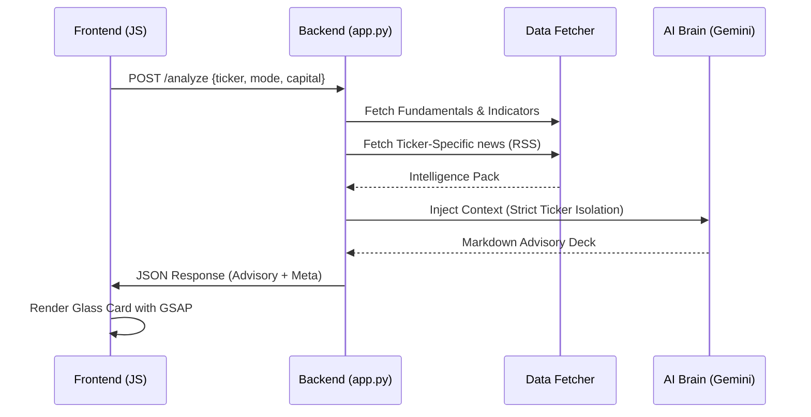

# Low-Level Design (LLD) - Sood AI Terminal
**Version:** 4.2.0  
**Status:** Active  
**Last Updated:** 2026-04-20  

## 1. Module Focus: Tactical Analysis Engine
The analysis engine is the core intelligence unit that synthesizes multiple data streams into a single "Kingpin Verdict".

### 1.1 Process Flow: Ticker Analysis
This flowchart describes the sub-second logic from input to AI response.



## 2. Module Focus: Top Movers (0-Token Engine)
High-velocity polling without AI consumption.

```mermaid
graph LR
    Start[Interval: 30s] --> AppFetch[GET /top_movers]
    AppFetch --> YFBatch[yFinance.download (Ticker List)]
    YFBatch --> Calc[Calculate % Price Change]
    Calc --> Sort[Sort by Magnitude]
    Sort --> JSON[Return Gainers & Losers JSON]
    JSON --> UIRender[Update Sidebar UI]
```

## 3. Data Schemas
### 3.1 SQLite: user_meta
Stores operator preferences for persistent dashboard sessions.
| Field | Type | Description |
|-------|------|-------------|
| user_id | TEXT (PK) | Primary Email identifier |
| market_preference | TEXT | "India", "US", or "Both" |
| ribbon_speed | TEXT | Animation speed token (e.g., "80s") |

## 4. Operational Logic: Ticker Isolation
To prevent AI "Hallucination" or cross-talk between tickers:
1. **Input Scrubber**: Converts input to clean ticker symbols (e.g., NVDA, TCS.NS).
2. **Context Purge**: Removes general global news during `/analyze` calls.
3. **Prompt Hardening**: "MANDATORY RULE: Focus ONLY on {ticker}".

## 5. Version History (Commits)
| Version | Action | Reason |
|---------|--------|--------|
| 4.2.0   | FEATURE: Movers | Implemented 0-Token Gainers/Losers UI. |
| 4.1.5   | FIX: Isolation | Isolated analysis to single ticker focus. |
| 4.1.0   | UI: Sidebar | Moved Intel to vertical right sidebar. |
| 4.0.5   | AUTH: Persistence | Added 30-day session cookies. |
